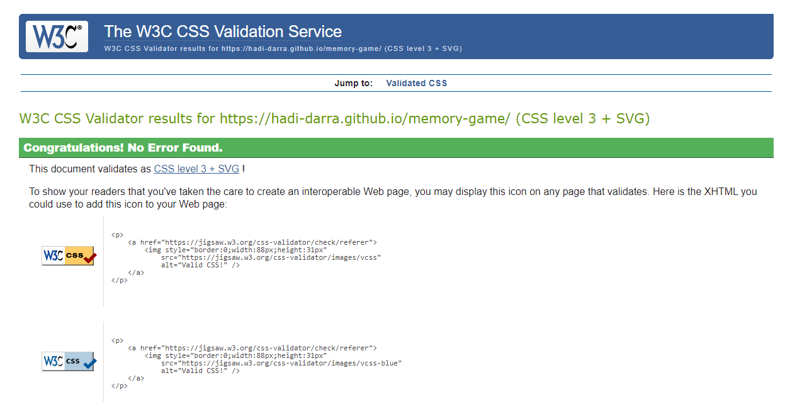
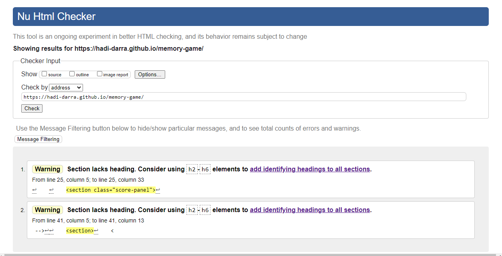
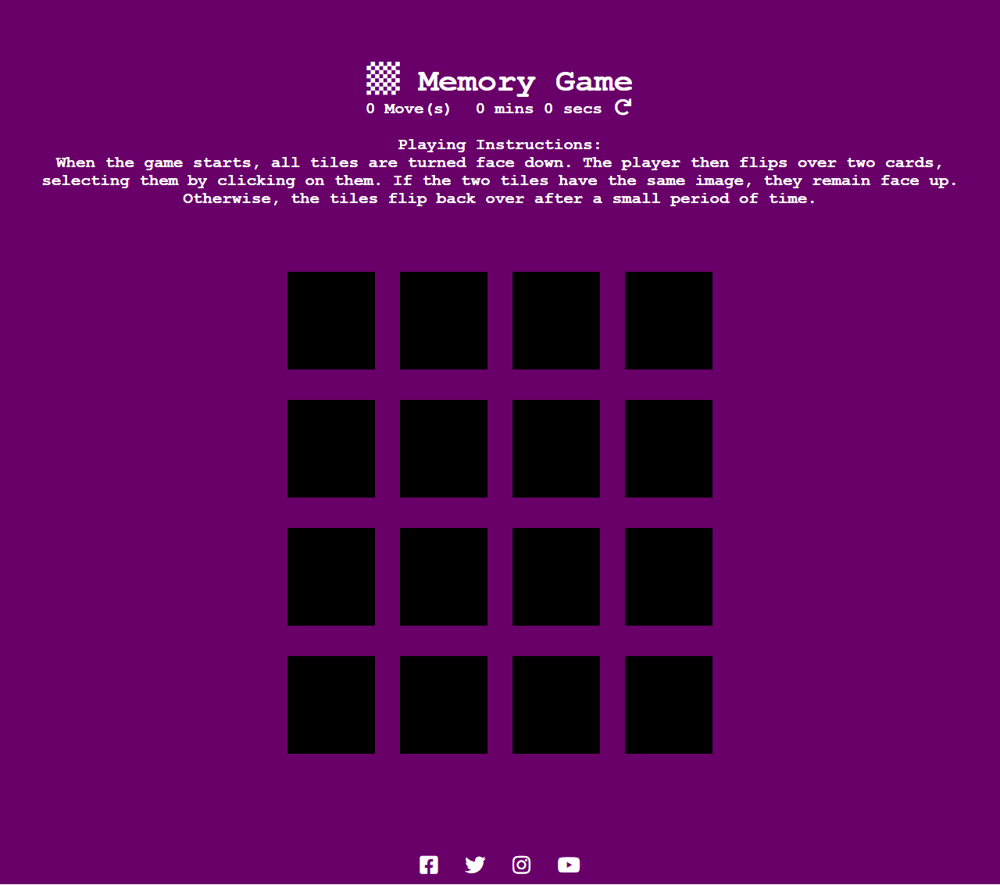
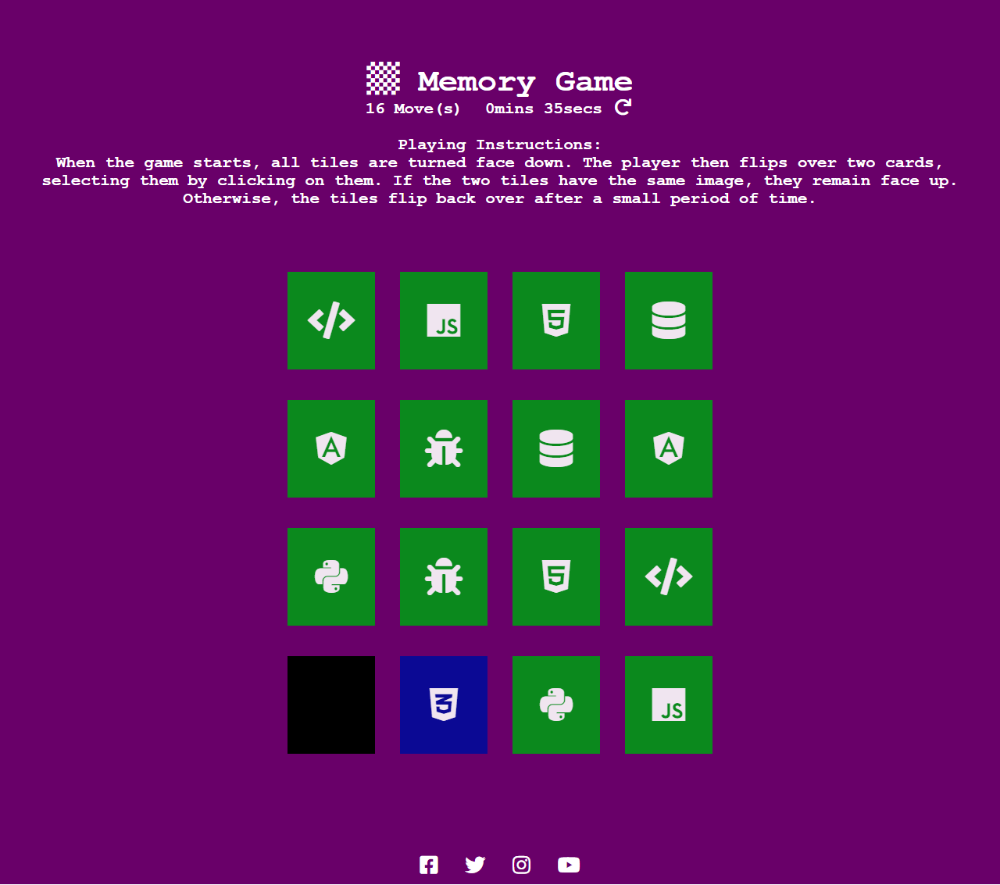
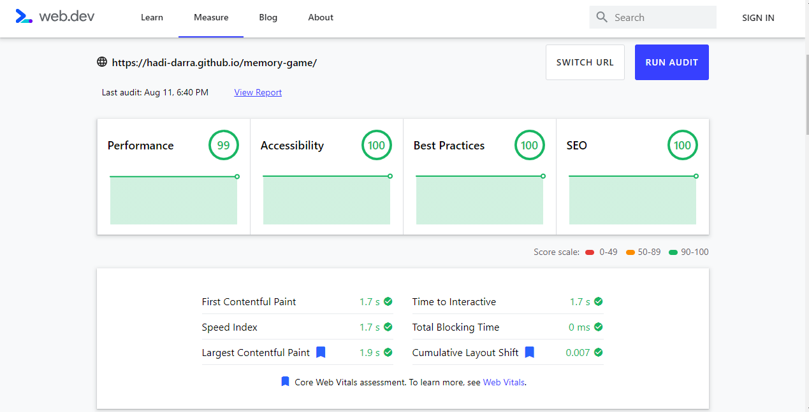
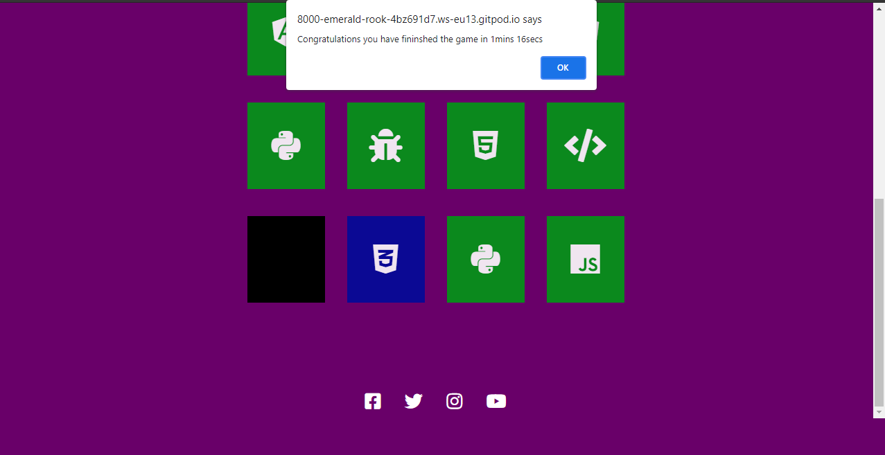
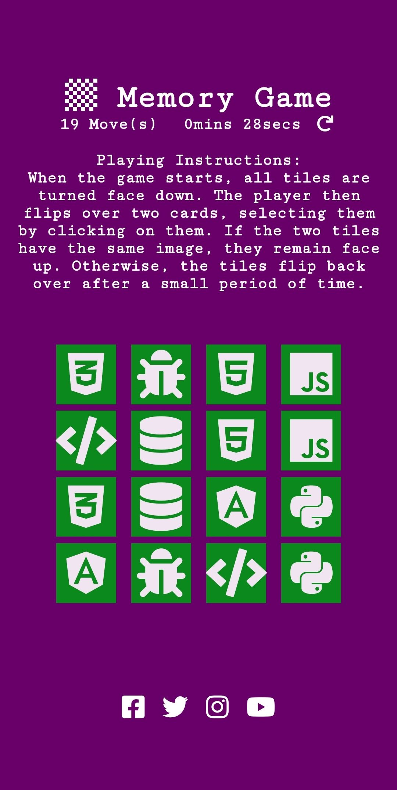

## Memory Game
A website for a Memory Game , "Memory game" is a fun game that you may have played in "real life", with actual paper tiles. It's called that because the main skill in the game is your memory - how well you can remember the position of tiles. It's also a game that can be re-created on a computer, and is a good example of using computer memory to remember information, like with arrays.

The website is implementation for which I have learned (HTML/CSS/JavaScript).
And I have built this website to present it for the project 2.
## Installation:
Click on Gitpod green button.

## Using the project: 
The project has 1 page. 
-	**Home page content:** 
1 – A title at the top. 
2- A  score panel which shows how many moves which the user made and a timer. 
3- A small paragraph about the *game's* instructions. 
4- A Cards deck which contains 16 cards (4x4). 
5- At the end our social media accounts links. 

-	**Tested on W3C CSS/HTML Validator:** 

## Our accounts on social media:
  - [Twitter](https://twitter.com/)
 - [Instagram](https://www.instagram.com/)
 - [Facebook](https://www.facebook.com/)
## Screenshots: 

## Resources: 
https://fontawesome.com/ 
https://www.khanacademy.org 
https://fonts.google.com/ 